## Vulnerability Description

The application fails to synchronize user role changes with active sessions, leading to an **authorization inconsistency**. Specifically:

- There are two admin accounts: **admin1** and **admin2**.
- Both users are logged into the application at the same time.
- **admin1** downgrades **admin2**'s role from admin to user.
- Despite the downgrade, **admin2** remains logged in and continues to **access and use admin-only features**.
- Worse, **admin2** can still **disable or downgrade admin1** even after their own role was changed to user.

This indicates that **authorization is not re-evaluated dynamically** per request or session state is not updated after role changes.

## Exploit Scenario

1. Both **admin1** and **admin2** are logged in as administrators.
2. **admin1** changes **admin2**’s role to user.
3. **admin2**, still using their existing session, can:
	Access admin dashboard and functions.
	Perform admin-level actions such as disabling **admin1** or changing their role.

4. This allows **unauthorized privilege retention and abuse** after role change.

## Root Cause

- **Lack of dynamic role/permission checks** on each request.
- **Session or token retains outdated permissions** after a role change.
- **No forced logout or session invalidation** upon permission updates.

## Recommendations

1. **Enforce permission checks per request**:
	- Don’t rely solely on session-stored roles.
	- Fetch updated roles from the database or a centralized RBAC/ABAC system.

2. **On role change**, especially downgrade:
	**Immediately invalidate or refresh active sessions** for that user.
	 **Force re-authentication** to enforce updated access levels.

3. **Implement audit logs**:
	- Track role changes with timestamps and initiators.
	- Trigger alerts for admin-to-admin permission modifications.

## Proof of Concept

**Step1: Build passbolt** **4.12 ce with docker**

Docker-compose file

```
version: '3'

services:

  passbolt:

    image: passbolt/passbolt:4.12.0-1-ce

    container_name: passbolt

    environment:

      APP_FULL_BASE_URL: http://passbolt.local  

      DATASOURCES_DEFAULT_HOST: db

      DATASOURCES_DEFAULT_USERNAME: passbolt

      DATASOURCES_DEFAULT_PASSWORD: passbolt

      DATASOURCES_DEFAULT_DATABASE: passbolt

      EMAIL_DEFAULT_FROM: no-reply@your-domain.com

      EMAIL_TRANSPORT_DEFAULT_HOST: mailhog

      EMAIL_TRANSPORT_DEFAULT_PORT: 1025

    ports:

      - "80:80"

      - "443:443"

    volumes:

      - gpg:/etc/passbolt/gpg

      - jwt:/etc/passbolt/jwt

    depends_on:

      - db

      - mailhog

  db:

    image: mariadb:10.5

    container_name: passbolt-db

    environment:

      MYSQL_ROOT_PASSWORD: root

      MYSQL_DATABASE: passbolt

      MYSQL_USER: passbolt

      MYSQL_PASSWORD: passbolt

    volumes:

      - db_data:/var/lib/mysql

  mailhog:

    image: mailhog/mailhog

    container_name: mailhog

    ports:

      - "8025:8025"

volumes:

  db_data:

  gpg:

  jwt:
```

```
docker-compose up -d
```

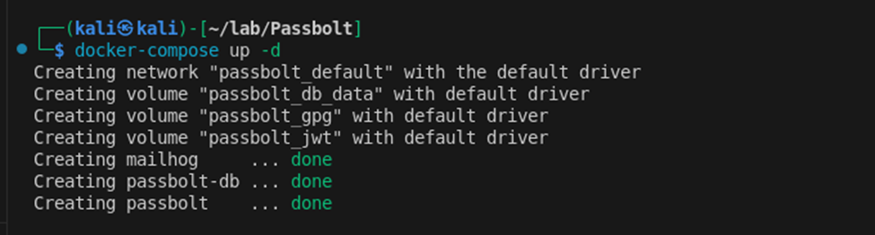


**Step 2: Create admin1 and setup**

```
docker exec passbolt su -m -c "bin/cake passbolt register_user -u admin1@local.tmp -f admin1 -l admin1 -r admin" -s /bin/sh www-data
```

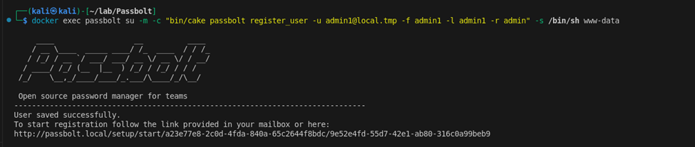

set up admin 1

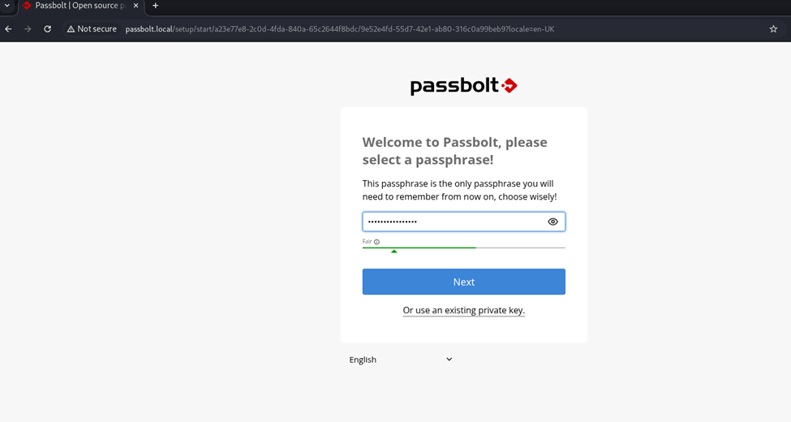


View user and group

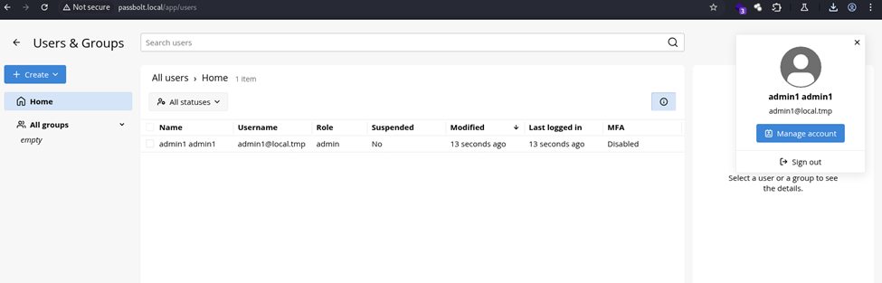

**Step 3: Create admin2 and setup**

```
docker exec passbolt su -m -c "bin/cake passbolt register_user -u admin2@local.tmp -f admin2 -l admin2 -r admin" -s /bin/sh www-data
```

Output 

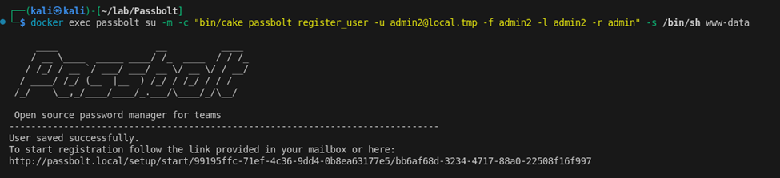


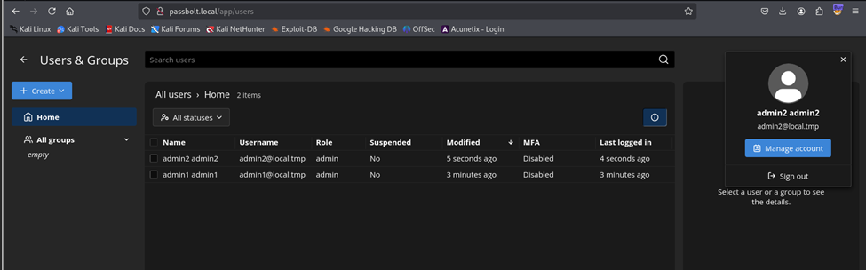


**Step 4: both admins are active now****. Admin1 change admin2’s role to user

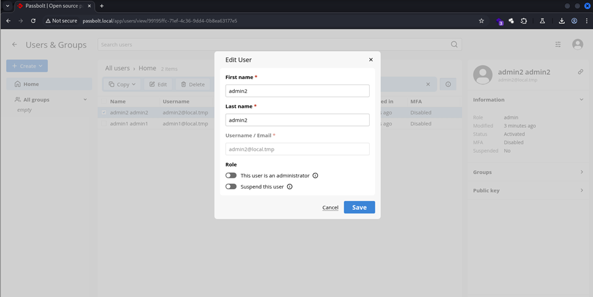


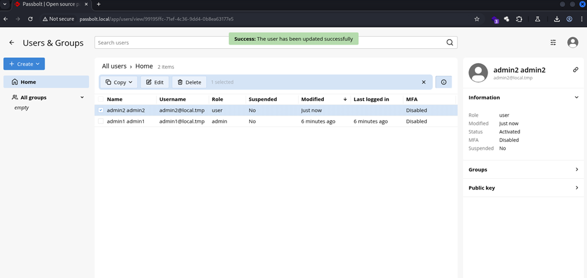


**Step 5: In the active admin2 session, admin2 can still perform admin actions as change role user admin1**
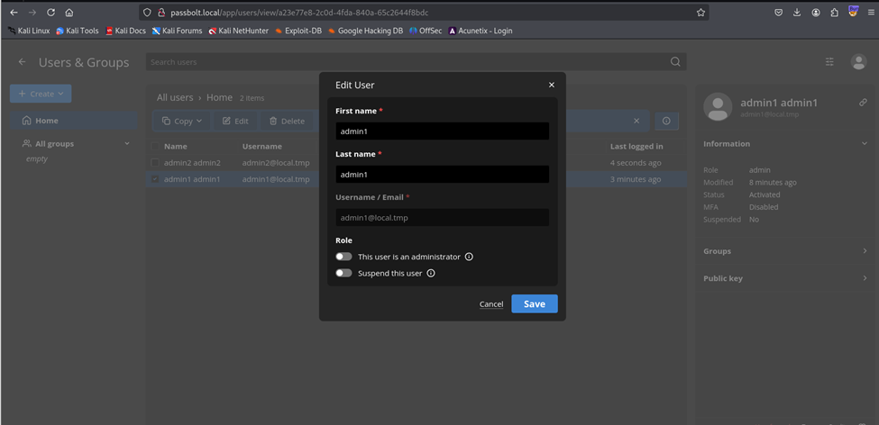


**Step 6: Reload all page, both have user role**

On session of admin1

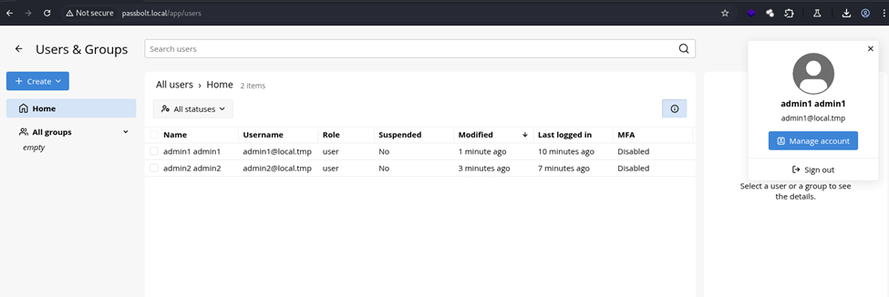

On session of admin2
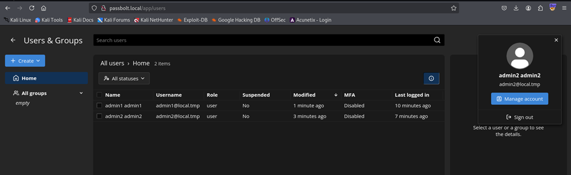

**Step 7: now admin 2 is user can disable admin1**

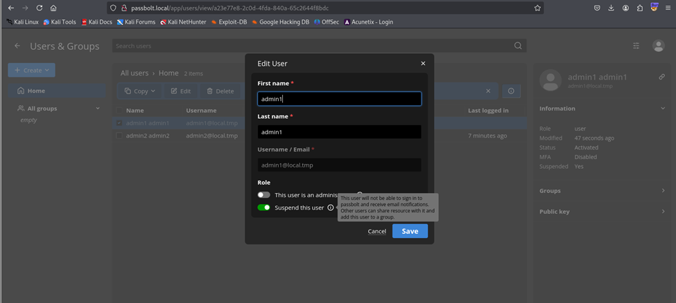

## Video
